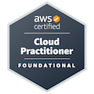

Hello, I'm **Akil Mahmod Tipu**, a DevOps engineer with the ability to fully automate the _code-to-production_ workflow.

As an DevOps Engineer, I specialize in automating software delivery pipelines, implementing Infrastructure as Code, and orchestrating cloud platforms. With a deep grasp of DevOps principles like continuous delivery and integration(_CI/CD_), I optimize workflows, reduce manual effort, and foster cross-team collaboration. 

My passion for learning drives me to explore innovative solutions that enhance the development process. I have a proven track record of seamlessly integrating cutting-edge technologies and best practices to deliver high-quality software consistently. 

### Skills

- **Programming Languages and Tools:** Python, Bash, Git, Linux, C, SQL, JavaScript
- **DevOps Tools:** Kubernetes, Terraform, Jenkins, Ansible, Maven, Gradle, Docker, NPM, Prometheus, SonarQube, Grafana, GitPod, GitOps, Terraform Cloud
- **Cloud Skills:** AWS (EC2, Fargate, ECS, EKS, Serverless, Containerization, ALB, ASG, Aurora, CodePipeline, CodeArtifact, S3)
- **Frameworks:** Scrapy, Next.js

### Certifications
- AWS Cloud Technology Consultant (AWS - Coursera) - February 2024
- AWS Certified Solutions Architect – Associate (AWS) - December 2023
- AWS Certified Cloud Practitioner (AWS) - July 2023
- AWS Academy Graduate - AWS Academy Cloud Foundations (AWS) - February 2021
- Scientific Computing and Python for Data Science (The Data Incubator) - December 2019
- Programming for Everybody (Python), University of Michigan - Coursera - August 2015

### View my verified badges
   

### Reach out to me on:
 
- **LinkedIn:** [https://www.linkedin.com/in/akiltipu](https://www.linkedin.com/in/akiltipu/)

- **𝕏:** [https://twitter.com/akiltipu](https://twitter.com/akiltipu)

- **Personal Website:** [www.akiltipu.com](https://akiltipu.com)

_(If you need a DevOps Engineer who can drive automation, rapid iterations, and reliable deployments, I'm confident in making a significant impact on your team.)_

