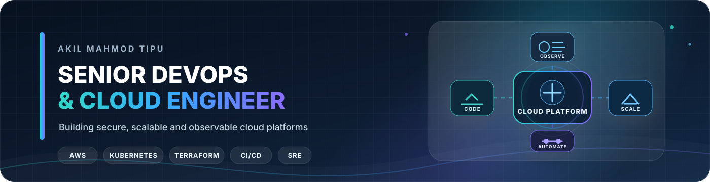
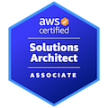
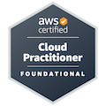
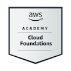

  

<h1 align="center">Hi, I'm Akil Mahmod Tipu</h1>

  <strong>Senior DevOps & Cloud Engineer at BJIT Limited</strong> 
  AWS • Kubernetes • Terraform • CI/CD • Platform Engineering • SRE

  
  
  
  

## About me

I build secure, scalable, observable, and cost-efficient cloud platforms on AWS. My work spans infrastructure architecture, Infrastructure as Code, container orchestration, CI/CD, serverless systems, cloud security, observability, automation, and production operations.

I enjoy taking ownership beyond deployment: investigating complex failures, improving engineering workflows, reducing operational overhead, mentoring teammates, and turning recurring manual work into reliable automation.

## Engineering impact

- Lead a four-member DevOps team delivering and supporting production cloud platforms.
- Helped the team earn customer **Quarter Best Performer recognition for three consecutive quarters**.
- Reduced monthly AWS logging costs by **more than $7,000** through a modernized ELK/Kibana-based logging architecture.
- Supported high-volume cloud services processing **500,000+ requests per day**.
- Improved delivery reliability through proactive troubleshooting, reusable automation, CI/CD improvements, and stronger operational ownership.

## Core stack

| Area | Technologies |
|---|---|
| **Cloud** | AWS ECS/Fargate, EKS, EC2, Lambda, API Gateway, S3, SQS, KMS, IAM, CloudFront, RDS, EventBridge, Route 53 |
| **Infrastructure as Code** | Terraform, AWS CDK, CloudFormation, Terraform Cloud |
| **Containers & Platforms** | Docker, Kubernetes, Amazon EKS, Amazon ECS, Helm, NGINX |
| **CI/CD & DevSecOps** | Jenkins, GitHub Actions, GitOps, SonarQube, Trivy, Nexus, ECR |
| **Observability** | Datadog, CloudWatch, ELK/Kibana, Prometheus, Grafana |
| **Languages & Scripting** | Go, Python, Bash, TypeScript, JavaScript, Ruby, SQL |
| **Security** | IAM, KMS, Secrets Manager, JWT/JWKS, cross-account access, least-privilege design |

## Selected projects

| Project | What it demonstrates |
|---|---|
| [**SecureShop DevOps**](https://github.com/akiltipu/secure-shop-devops) | End-to-end DevSecOps pipeline with Jenkins, Maven, SonarQube, Trivy, Nexus, Docker, Amazon ECR, and Amazon EKS. |
| [**Microservices on EKS with Terraform**](https://github.com/akiltipu/microservice-eks-tf) | Terraform-based EKS infrastructure and Kubernetes deployment for a multi-service application platform. |
| [**AWS Log Processing**](https://github.com/akiltipu/log-processing-aws) | AWS-based log-processing architecture and automation patterns for scalable observability. |
| [**Kibana Watcher Automation**](https://github.com/akiltipu/kibana-watcher-automation) | Automated deployment and management of Kibana watchers using GitHub Actions. |
| [**AWS Static Website with Terraform**](https://github.com/akiltipu/Deploying-a-Static-Website-on-AWS-with-Terraform) | Infrastructure as Code for deploying and managing a static website on AWS. |

## Certifications

- **HashiCorp Certified: Terraform Associate (004)** — July 2026
- **GitHub Foundations** — November 2024
- **AWS Certified Solutions Architect – Associate** — December 2023
- **AWS Certified Cloud Practitioner** — July 2023
- **AWS Cloud Technology Consultant Professional Certificate** — February 2024
- **AWS Academy Cloud Foundations** — February 2021

### Verified AWS badges

  
  
  

## Current focus

- Building stronger platform engineering and SRE practices.
- Developing cloud-native and serverless systems with Go and Python.
- Deepening expertise in Kubernetes, Terraform, AWS security, and observability.
- Exploring practical AI engineering for infrastructure and operations workflows.

## Connect with me

  
  
  

> I care about automation that improves delivery speed, reliability, security, and the day-to-day experience of engineering teams.
